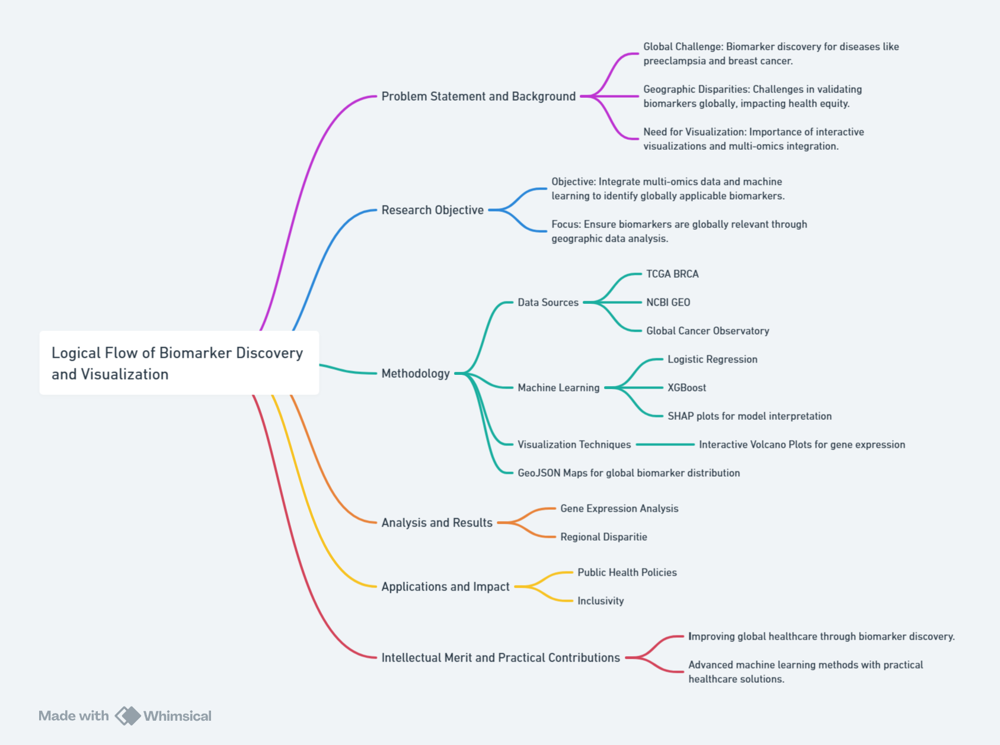

# Uncovering Geographic Variability in Breast Cancer Biomarkers: Integrating Machine Learning and Interactive Visualizations for Global Insights

By: Yian Pei,  Munkh-Orshikh Munkhbold, Lauris Vo

**INFOSCI 301: Data Visualization and Information Aesthetics**  
Instructor: Prof. Luyao Zhang  
2024 Autumn Term

---

### 1. Background and Motivation

Breast cancer is one of the most common cancers diagnosed worldwide, making early detection and effective treatment essential for better patient outcomes. To achieve these goals, biomarkers—such as specific genes, proteins, or other molecules—play a critical role. These biological indicators are linked to cancer development and progression and provide valuable insights into the unique characteristics of each patient’s tumor. By revealing tumor characteristics, predicting therapy responses, and monitoring disease progression, it helps detect diseases, predict outcomes, and guide personalized treatments. In this context, bioinformatics plays a vital role in studying and visualizing these biomarkers, especially given the complexity and size of genomic data. Effective visualizations make complicated patterns in biomarker data easier to understand for researchers, doctors, and non-specialists. These insights are pivotal for advancing personalized medicine in breast cancer, where tailored strategies can significantly enhance survival rates. In this project, we will focus on implementing bioinformatics in breast cancer analysis, and the overall structure is shown in Figure 1.

*Figure 1: Map of the research report. Created with Whimsical.*

Recent research has highlighted the complex interplay between cultural background and an individual's ability to discern truth from falsehood in news and information. Factors such as political alignment, trust in media, and social network behavior strongly shape misinformation susceptibility (Arechar et al. 2023; Guess et al. 2020). Studies exploring amplification dynamics have also emphasized the role of social context, such as user interactions and publisher-news relationships, in misinformation detection (Shu, Wang, and Liu 2019). Our research addresses these gaps by leveraging data visualization to illuminate complex relationships and patterns within misinformation dynamics.

Inspired by Munzner's (2014) visualization principles, we focus on creating tools that effectively communicate intricate patterns of misinformation spread and detection. By combining cross-cultural studies with social network analysis, our visualizations aim to highlight how misinformation propagates across and within cultural boundaries. Building on geospatial analysis concepts, such as those proposed by Liu et al. (2024) and Andrienko et al. (2020), our project incorporates temporal and regional insights into misinformation spread. For example, by color-coding regions based on misinformation detection accuracy and susceptibility, we aim to identify vulnerable areas and observe the impact of initiatives, such as media literacy programs, over time.

#### 1.1 Visualization Inspirations

##### Geospatial Mapping for Regional and Temporal Coverage

*Figure 2: Geospatial map adapted from Liu et al. (2024), showing the number of metrics covered per country in 2019.*

Figure 2 depicts a geospatial map adapted from the “WISE database” by Liu et al. (2024), illustrating the number of metrics covered per country in 2019. This map leverages over one million data points spanning 218 countries and 61 country groupings, showcasing the comprehensive spatial and temporal coverage of societal progress metrics. Most countries are represented by more than eighty metrics in 2019, with lower coverage primarily observed in some African nations. The visualization’s ability to display data density across diverse regions inspired our approach to mapping misinformation susceptibility and detection accuracy.

##### Keyword Interactions and Clustering

*Figure 3: Network diagram by Cano-Marin et al. (2023), illustrating thematic clusters and connections between concepts.*

Figure 3 showcases a network diagram by Cano-Marin et al. (2023), which maps connections between key concepts such as “health,” “information,” and “analysis.” This visualization’s use of color-coded clusters and linkages inspired our approach to representing misinformation dynamics visually. By grouping terms into thematic clusters, we emphasize how misinformation propagates through tightly connected social or cultural groups. Adopting similar techniques, we utilize varied node sizes and edge thicknesses to indicate misinformation susceptibility and detection accuracy across regions and networks. This method uncovers hidden dynamics in misinformation spread, making complex patterns accessible and actionable.

#### 1.2 Contribution and Impact

Our project bridges the gap between raw data and actionable insights by providing innovative visualization techniques that make complex patterns in misinformation accessible. Integrating advanced data analysis frameworks, such as Shu et al.’s (2019) tri-relationship embedding framework, enables granular analysis of user, publisher, and content interplay. By combining these frameworks with geospatial and network-based approaches, we aim to provide stakeholders with tools to identify critical areas for intervention, fostering a more informed and resilient global society.

---

### 2. Research Questions

Understanding and addressing misinformation requires a multi-faceted approach that combines insights from various disciplines. This project aims to tackle the complex dynamics of misinformation by integrating innovative visualization techniques, machine learning, and cross-disciplinary perspectives. Each research question focuses on a specific aspect of misinformation detection and susceptibility, drawing on the strengths of data visualization and computational analysis to uncover hidden patterns and provide actionable insights. The questions outlined below form the foundation for exploring the interplay between cultural influences, user engagement, and the spread of false information, offering a comprehensive framework for understanding and mitigating the impact of misinformation.

- **How can interactive geospatial visualizations enhance the understanding of cultural influences on misinformation detection across different regions?**

- **What novel insights emerge from visualizing the relationships between user credibility and misinformation spread using network-based representations?**

- **In what ways can interactive visualizations reveal patterns in user engagement with misinformation across various intellectual backgrounds?**

- **How can machine learning be utilized to illustrate the relative importance of cultural factors in misinformation susceptibility?**

These research questions are inherently cross-disciplinary, combining elements from data visualization, social policy, computational social science, behavioral science, and cultural studies. By integrating open-source data, machine learning techniques, and interactive visualizations, the project seeks to offer innovative solutions to the challenge of misinformation detection, bridging computational approaches with social and cultural analysis.

---

### 3. Application Scenarios

#### 3.1 Practical Applications

- Geospatial visualizations can guide targeted media literacy campaigns in regions with heightened misinformation susceptibility.
- Network visualizations can inform content moderation strategies by identifying pivotal nodes in misinformation spread.
- Visualizing user engagement patterns can aid in designing educational programs tailored to specific vulnerabilities.
- Machine learning insights provide actionable recommendations for culturally informed policies.

#### 3.2 Societal Impact

The combination of geospatial mapping and network analysis equips stakeholders with tools to address the global challenge of misinformation. These visualizations provide actionable insights, fostering international collaboration and promoting transparency in digital platforms.

#### 3.3 Industry and Disciplinary Links

Applications span social media moderation, policymaking, academic research, and media fact-checking. Collaboration opportunities exist for platforms like Facebook, NGOs, and international organizations such as UNESCO.

---

### 4. Methodology

#### 4.1 Visualization Techniques

- **Interactive Map:** Visualizes credibility scores by country, integrating spatial data with color gradients.
- **Network Visualizations:** Three networks (“Supports,” “Refutes,” and combined) highlight relationships in misinformation data.
- **Impact of Social Media on Intellect:** Explores the relationship between social media usage and cognitive performance.
- **Feature Importance Bar Graph:** Derived from a Random Forest model to rank predictors of misinformation susceptibility.

#### 4.2 Data Sources and Integration

Two datasets were utilized:
1. **Main Dataset:** Behavioral and demographic variables.
2. **Climate-FEVER Dataset:** 1,500+ claims labeled as “SUPPORTS,” “REFUTES,” or “NOT ENOUGH INFO” (University of Zurich 2023).

#### 4.3 Advanced Tools

- **Interactive Technologies:** Dash, Plotly, and Pyecharts.
- **Machine Learning:** Random Forest model to predict misinformation labels and identify key predictors.

---

### 5. Results

#### 5.1 Network Visualization Analysis

*[Figure 5: Betweenness centrality for the "Refutes" network.](/Visualizations/Fig_5.pdf)*

*[Figure 6: Betweenness centrality for the "Supports" network.](/Visualizations/Fig_6.pdf)*

*[Figure 7: Modularity-colored graph for the "Refutes" network.](/Visualizations/Fig_7.pdf)*

*[Figure 8: Modularity-colored graph for the "Supports" network.](/Visualizations/Fig_8.pdf)
*

*Figure 9: Static image of the Plotly interactive network combining “Supports” and “Refutes” data.*

#### 5.2 Machine Learning Key Features

*Figure 11: Feature importance plot from Random Forest model.*

Machine learning analysis revealed education level, CRT scores, and social media usage as key predictors of misinformation susceptibility. These insights emphasize the importance of tailored media literacy programs and critical thinking education.

---

### 6. Intellectual Merit and Practical Impacts

#### 6.1 Academic Contribution

The project combines data visualization and machine learning to uncover complex patterns in misinformation. Network visualizations provide nuanced insights into climate discourse, while machine learning identifies actionable predictors of susceptibility. Open-source Gephi and ML scripts foster collaboration.

#### 6.2 Practical Impacts

Geospatial and network visualizations empower policymakers and platforms to address misinformation dynamically. Machine learning recommendations support targeted interventions for vulnerable demographics, enhancing the resilience of the global information ecosystem.

---

### 7. References

Andrienko, Natalia, Gennady Andrienko, Georg Fuchs, Aidan Slingsby, Cagatay Turkay, and 
Stefan Wrobel. 2020. Visual Analytics for Data Scientists. Cham: Springer International Publishing.

Arechar, A.A., Allen, J., A.J. Berinsky, et al. 2023. "Understanding and Combatting 
Misinformation across 16 Countries on Six Continents." Nature Human Behaviour 7: 1502–1513. https://doi.org/10.1038/s41562-023-01641-6.

Cano-Marin, Enrique, Marçal Mora-Cantallops, and Salvador Sanchez-Alonso. "The Power of Big Data Analytics over Fake News: A Scientometric Review of Twitter as a Predictive System in Healthcare." Technological Forecasting and Social Change 190, (2023): 122386. Accessed November 24, 2024. https://doi.org/10.1016/j.techfore.2023.122386.

Guess, Andrew M., Michael Lerner, Benjamin Lyons, Jacob M. Montgomery, Brendan Nyhan, 
Jason Reifler, and Neelanjan Sircar. 2020. "A Digital Media Literacy Intervention Increases Discernment between Mainstream and False News in the United States and India." Proceedings of the National Academy of Sciences 117 (27): 15536–45. https://doi.org/10.1073/pnas.1920498117.

Liu, K., Wang, R., Behrens, P., et al. 2024. "A Comprehensive Beyond-GDP Database to 
Accelerate Wellbeing, Inclusion, and Sustainability Research." Scientific Data 11: 1166. https://doi.org/10.1038/s41597-024-04006-4.

Munzner, Tamara. 2014. Visualization Analysis and Design. Boca Raton: CRC Press.

Shu, Kai, Suhang Wang, and Huan Liu. 2019. "Beyond News Contents: The Role of Social 
Context for Fake News Detection." In Proceedings of the Twelfth ACM International Conference on Web Search and Data Mining (WSDM '19), 312–20. New York: Association for Computing Machinery. https://doi.org/10.1145/3289600.3290994.

University of Zurich. 2023. "Climate-FEVER Dataset." Sustainable Finance Lab. Accessed 
December 6, 2024. https://www.sustainablefinance.uzh.ch/en/research/climate-fever.html.

