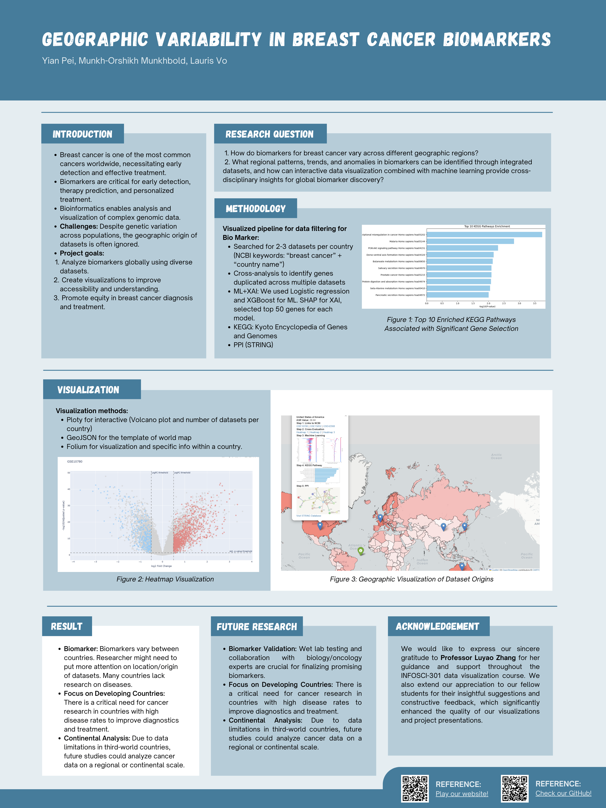

# **Uncovering Geographic Variability in Breast Cancer Biomarkers: Integrating Machine Learning and Interactive Visualizations for Global Insights**

## Project Information

- **Authors**: Yian Pei, Munkh-Orshikh Munkhbold, Lauris Vo
- **Instructor**: Professor Luyao Zhang, Duke Kunshan University

## Disclaimer
This is the final project for **INFOSCI 301: Data Visualization and Information Aesthetics**, instructed by **Prof. Luyao Zhang** at **Duke Kunshan University** in **Autumn 2024**.

## Acknowledgments
We would like to express our gratitude to the following individuals and resources:
- **Prof. Luyao Zhang** for guidance and support throughout the course.
- Our **classmates** for their valuable feedback and collaboration.
- **AIGC tools** like **ChatGPT** for assistance with coding, ideas, and suggestions.
- **NCBI** for the breast cancer datasets and **GEOJSON** for geographic data.

## Embedded Media

### Demo Video

https://github.com/user-attachments/assets/c176d294-00f8-43ff-aca0-615c9463e7bc

Original Demo Video can be found [here](./Docs/Demo.mp4).

### Poster

## Statement of Intellectual and Professional Growth
Throughout this course, we have deepened our understanding of data visualization techniques and their role in effectively communicating complex information. This project has enhanced our ability to design interactive and meaningful visualizations, and it has also improved our skills in presenting data-driven insights. The collaborative nature of this project has strengthened our teamwork and communication skills, as we worked together to solve data-related challenges and incorporate visual storytelling in a professional setting.

## Table of Contents
- [Project Overview](#project-overview)
- [Data](#data)
- [Code](#code)
- [Visualizations](#visualizations)
- [Dependencies & Environment Setup](#dependencies-environment-setup)
- [Acknowledgments](#acknowledgments)
- [Intellectual and Professional Growth](#statement-of-intellectual-and-professional-growth)

## Navigation Instructions
To navigate through this repository, please follow the instructions below:

### Code
- The code for simulations, data processing, and visualizations can be found in the **`/Code`** folder.

### Sample Datasets & Processed Data
- All datasets used in this project are located in the **`/Data`** folder. This includes both raw and processed data.

### Documentation
- Additional Documents can be found in the **`/Docs`** folder.

### Pilot Visualizations & Figures
- Sample visualizations and figures are available in the **`/Visualization`** folder.

