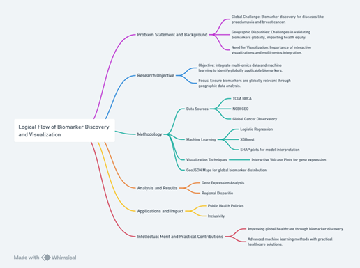

# **Uncovering Geographic Variability in Breast Cancer Biomarkers: Integrating Machine Learning and Interactive Visualizations for Global Insights**

## Project Information

- **Authors**: Yian Pei, Munkh-Orshikh Munkhbold, Lauris Vo
- **Instructor**: Professor Luyao Zhang, Duke Kunshan University
- **Project Summary**
  

## Disclaimer
This is the final project for **INFOSCI 301: Data Visualization and Information Aesthetics**, instructed by **Prof. Luyao Zhang** at **Duke Kunshan University** in **Autumn 2024**.

## Contribution Statement

Each team member contributed according to their strengths, ensuring a balanced and efficient collaboration across all deliverables. Together, we combined our skills to successfully complete the project.

## Acknowledgments
We would like to express our gratitude to the following individuals and resources:
- **Prof. Luyao Zhang** for guidance and support throughout the course.
- Our **classmates** for their valuable feedback and collaboration.
- **AIGC tools** like **ChatGPT** for assistance with coding, ideas, and suggestions.
- **NCBI** for the breast cancer datasets and **GEOJSON** for geographic data.

## Embedded Media

### Demo Video

https://github.com/user-attachments/assets/c176d294-00f8-43ff-aca0-615c9463e7bc

Original Demo Video can be found [here](./Docs/Demo.mp4).

### Poster


## Statement of Intellectual and Professional Growth
Throughout this course, we have deepened our understanding of data visualization techniques and their role in effectively communicating complex information. This project has enhanced our ability to design interactive and meaningful visualizations, and it has also improved our skills in presenting data-driven insights. The collaborative nature of this project has strengthened our teamwork and communication skills, as we worked together to solve data-related challenges and incorporate visual storytelling in a professional setting.

## Table of Contents
- [Project Information](#project-information)
- [Disclaimer](#disclaimer)
- [Contribution Statement](#contribution-statement)
- [Acknowledgments](#acknowledgments)
- [Embedded Media](#embedded-media)
  - [Demo Video](#demo-video)
  - [Poster](#poster)
- [Statement of Intellectual and Professional Growth](#statement-of-intellectual-and-professional-growth)
- [Data](#data)
- [Code](#code)
- [Visualizations](#visualizations)
- [Dependencies & Environment Setup](#dependencies-environment-setup)
- [Final APP](#final-app)

## Navigation Instructions
To navigate through this repository, please follow the instructions below:

### [Code](./Code)
The code for simulations, data processing, and visualizations can be found in the `/Code` folder.

### [Sample Datasets & Processed Data](./Data)
All datasets used in this project are located in the `/Data` folder. This includes both raw and processed data.

### [Documentation](./Docs)
Additional documents can be found in the `/Docs` folder.

### [Pilot Visualizations & Figures](./Visualization)
Sample visualizations and figures are available in the `/Visualization` folder.

## Implementation

### Requirements

To get started with the project, you will need to install the following dependencies:

- pandas
- pyecharts
- xgboost
- shap
- matplotlib
- scikit-learn
- plotly
- numpy

You can install these dependencies by running the following command:

```bash
pip install -r requirements.txt
```

### Code Usage

We have designed a smooth workflow that can easily provide all necessary data.

#### For `Step2.ipynb`

Please ensure you have the GSE datasets ready. You can use ours [here](./Data). The code provided requires 3 datasets, but this number can be adjusted with minor modifications to the code.

There are two places in the code that you will need to modify:
1. Change the path to your GSE datasets.
2. Modify the line: 
   ```python
   min_files = 2
   ```
Choose a value between 2 - 3 (maximum number of GSE datasets). Ideally, choose the largest number possible while ensuring that the result includes at least 200 genes. If you select a lower number, make sure that the datasets still provide sufficient gene data for accurate analysis. 

Once these modifications are done, you can run the notebook to generate the required outputs for Step 2.

#### For `Step3 + Step4.ipynb`

You will need the results from `Step2.ipynb` and **TCGA Breast.csv** from [here](./Data). Modify the input and output file names accordingly to fit your data.

#### For `Table.ipynb`

You only need **Dataset Count.csv** from [here](./Data). Modify the path to your data.

#### For `Map.py`

You only need **Processed_Breast_Data.csv** from [here](./Data). Modify the path to your data. Additionally, new changes should be added directly to this file to modify the Final APP.

## Final APP

You can access the final app online via this [link](https://laurisisme.github.io/worldmap/). Additionally, we provide a local version of the app [here](./Visualization/Map.html). It contains all the figures generated throughout the project.

 
